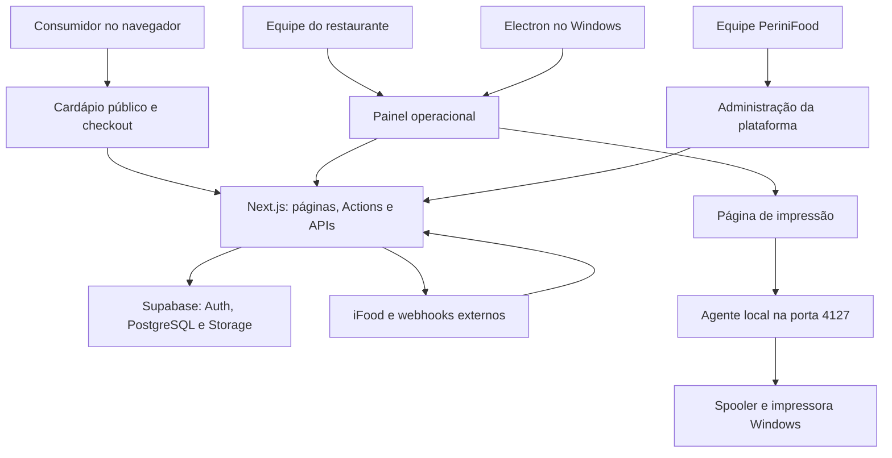

# PeriniFood — arquitetura e funcionamento

Análise do código local em 06/09/2026.

## 1. Escopo e conclusão

O PeriniFood é um SaaS para restaurantes, com foco em delivery, pizzarias e atendimento de balcão. A base ainda contém nomes GastroFlow em documentação, imagens, chaves de armazenamento e bucket de uploads.

A arquitetura é um monólito web em Next.js, apoiado em Supabase, com um aplicativo Windows que abre o sistema remoto e um agente local de impressão. Não há backend independente necessário para as operações web: páginas de servidor, Server Actions e Route Handlers executam esse papel.

Esta análise cobre estrutura, configurações, consultas, mutações, SQL versionado, integrações, impressão e módulos de negócio. Não foi uma auditoria do banco remoto, homologação das APIs externas ou teste de todos os fluxos no navegador. Implementação encontrada não significa funcionalidade homologada em produção.

## 2. Stack e responsabilidades

| Camada | Tecnologia / responsabilidade |
| --- | --- |
| Web | Next.js 16.2.6, App Router, React 19.2.4 e TypeScript |
| Interface | Tailwind CSS 4, componentes locais, Lucide, fonte Plus Jakarta Sans |
| Backend | Server Actions e Route Handlers no mesmo projeto Next.js |
| Dados | PostgreSQL acessado pelo SDK Supabase |
| Login da equipe | Supabase Auth com cookies e suporte SSR |
| Arquivos | Supabase Storage; fallback local em public/uploads |
| Modelagem auxiliar | Prisma 7.8 declarado; sem uso de PrismaClient encontrado em src |
| Hospedagem configurada | Vercel, região gru1, domínio canônico perinifood.com.br |
| Windows | Electron, empacotamento electron-builder/NSIS |
| Impressão | Agente Node.js local, PowerShell e spooler do Windows |

O seed também usa Supabase. O schema Prisma não é uma representação completa do banco atual: recursos como fichas técnicas e assinaturas da plataforma foram adicionados em SQL sem equivalentes completos nesse schema.

## 3. Organização do código

| Local | Papel |
| --- | --- |
| src/app | Rotas, layouts, páginas de servidor e endpoints HTTP |
| src/app/actions.ts | Principal concentração de mutações: 1.645 linhas na análise |
| src/app/admin/actions.ts | Gestão de clientes SaaS, contratos e recebimentos |
| src/components | Carrinhos, checkout, formulários, navegação, gráficos e impressão |
| src/lib/auth.ts | Usuário atual, vínculo com restaurante e bloqueio por assinatura |
| src/lib/supabase | Clientes de navegador, servidor com cookies e servidor privilegiado |
| src/lib/types.ts | Tipos de domínio escritos manualmente |
| src/lib/reports.ts | Carregamento e agregação dos relatórios |
| src/lib/opening-hours.ts | Abertura automática e intervenção manual |
| src/lib/loyalty.ts | Elegibilidade e validade de pontos |
| src/lib/recipes.ts | Fichas técnicas de produção |
| src/lib/integrations | Normalização genérica, providers antigos e integração real iFood |
| src/integrations | Mappers, exemplos e fachadas que também reexportam código de lib |
| supabase/schema.sql | Estrutura base, políticas RLS e triggers |
| supabase/migrations | Evoluções incrementais do banco |
| prisma | Modelagem parcial, migration antiga e seed |
| desktop | Aplicativo Windows e instalador |
| scripts | Agente de impressão e instalação/distribuição |

As páginas consultam Supabase diretamente e passam dados para componentes interativos. Formulários chamam Server Actions; após alterações, o código usa revalidatePath e redirecionamentos. As APIs HTTP coexistem com as Actions e nem sempre aplicam as mesmas regras.

Os grupos de rota `(painel)` separam layouts sem aparecer na URL. Há duas famílias de telas administrativas, `/dashboard/...` e rotas em português como `/pedidos` e `/cardapio`. Não são todas aliases: existem implementações paralelas, enquanto `/dashboard/reports` redireciona para `/relatorios`.

## 4. Áreas do produto

| Área | Rotas principais | Funcionamento |
| --- | --- | --- |
| Comercial | /, /planos | Apresentação e planos |
| Acesso da loja | /login, /register | Login e cadastro do restaurante |
| Operação | /dashboard, /pedidos, /pedidos/novo | Indicadores, pedidos e balcão |
| Catálogo | /cardapio e subrotas | Categorias, produtos, adicionais, tipos, opções de pizza e fichas |
| Consumidor | /cardapio/[slug], /checkout e /conta sob o slug | Cardápio, compra e conta |
| Acompanhamento | /pedido/[codigo] | Consulta pública de status e itens |
| Gestão | /clientes, /cupons, /relatorios, /configuracoes | Clientes, promoções, relatórios e loja |
| Canais externos | /integracoes e subrotas | Configuração, mapeamentos, catálogo e logs |
| Impressão | /pedidos/[id]/print, /impressao, /ficha/[id]/print | Comandas, configuração e fichas |
| Plataforma | /admin e subrotas | Restaurantes, assinaturas, módulos e pagamentos |

## 5. Autenticação, empresas e autorização

### Equipe do restaurante

O cadastro cria usuário em Supabase Auth, registro em restaurants e vínculo owner em restaurant_users. São operações separadas. getSessionContext valida o usuário e busca seu primeiro vínculo por data; o resultado é memoizado por requisição com React cache.

O banco suporta vários restaurantes e múltiplos vínculos, mas o contexto atual escolhe apenas o primeiro restaurante. Não há seletor de unidade nesse fluxo.

requireRestaurant redireciona usuários sem sessão ou restaurante e consulta a assinatura para barrar estados suspended/canceled. O proxy renova a sessão nas rotas configuradas e reescreve a raiz do subdomínio admin para /admin; a autorização efetiva fica nos helpers e no banco.

O isolamento pretendido combina filtros restaurant_id e RLS. O cliente service_role ignora RLS, portanto cada operação que o utiliza depende de validações explícitas no servidor.

### Administração da plataforma

requirePlatformAdmin exige sessão e e-mail incluído em PLATFORM_ADMIN_EMAILS. Depois fornece acesso privilegiado entre restaurantes. platform_subscriptions e platform_payments sustentam contratos, vencimentos, módulos, suspensão e registro de recebimentos. Não foi encontrado fluxo de cobrança automática com gateway.

Os módulos contratados são cadastráveis, porém hasModule não tem consumidores encontrados em src. Cadastrar módulos não equivale hoje a restringir todas as funcionalidades por contrato.

### Consumidores

Clientes do cardápio usam customers e senha com scrypt, separados do Supabase Auth da equipe. O login devolve um perfil que a interface armazena em localStorage; o endpoint não emite sessão autenticada. Esse desenho apresenta falhas detalhadas na seção 11.

## 6. Modelo de dados

O restaurante é o eixo da modelagem:

- **Identidade:** restaurants e restaurant_users, associados a auth.users.
- **Catálogo:** categories, product_types, products, product_variants, product_options, product_option_items, product_addons e pizza_options.
- **Produção:** product_recipes, com ingredientes, etapas, rendimento, padrão visual e observações por produto.
- **Clientes:** customers e customer_addresses.
- **Vendas:** orders, order_items e order_item_addons.
- **Operação:** tables, cash_registers e cash_movements.
- **Promoções:** coupons e loyalty_programs.
- **Entrega:** delivery_fee_rules.
- **Canais:** integrations, integration_product_maps, integration_payment_maps, integration_orders e integration_logs.
- **Gestão SaaS:** platform_subscriptions e platform_payments; existe também subscriptions na estrutura base.

Pedidos preservam nomes, preços e opções selecionadas, funcionando como um retrato da compra. As opções detalhadas ficam em JSON selected_options, além de adicionais em tabela própria.

Há configurações heterogêneas dentro de opening_hours, incluindo fallbacks de taxas de entrega e campanha de fidelidade. Isso revela adaptação a bancos com migrations distintas, mas mistura responsabilidades e exige cuidado ao atualizar esse JSON.

## 7. Fluxo de venda

1. A página pública encontra restaurants pelo slug e busca catálogo ativo, opções, taxas e promoções.
2. PublicMenuOrder monta a compra; o checkout recupera o carrinho de sessionStorage por slug.
3. O consumidor informa dados, entrega/retirada e pagamento. Há consulta de CEP via ViaCEP e geocodificação via Nominatim no navegador.
4. createPublicOrder chama createOrderFromCart. O servidor verifica abertura da loja para source=site, consulta produtos, variantes e adicionais e monta os itens.
5. A regra de pizza usa o maior preço entre a base e os sabores selecionados. Massa, borda e adicionais compõem o valor final.
6. O código identifica/cria cliente, grava orders, depois order_items e adicionais, em chamadas separadas.
7. O PDV usa o mesmo núcleo, marca pagamento como paid e pode redirecionar para impressão. Pedidos do site começam pending para pagamento e operação.
8. O painel altera o status e pode sincronizá-lo ao iFood. A conclusão manual de pedidos iFood é barrada na Action; eventos externos concluem o pedido.

Estados previstos: pending, accepted, preparing, ready, out_for_delivery, completed e canceled. As atualizações não compõem uma máquina de estados central que valide todas as transições e todos os canais de entrada.

OrdersAutoRefresh atualiza dados a cada 15 segundos enquanto a aba está visível e ao retornar ao foco. Não foi encontrada assinatura Supabase Realtime para pedidos.

## 8. Integrações

Há três estruturas coexistentes: providers mockados em lib/integrations/providers, mappers/fachadas em src/integrations e implementação real em lib/integrations/ifood.

O iFood implementa autenticação, busca de eventos/detalhes, mapeamento, atualização de status e envio de catálogo, incluindo pizzas. As credenciais da aplicação vêm do ambiente; o merchantId identifica a integração/restaurante.

O endpoint /api/integrations/ifood/poll executa polling e acknowledgement. Seu comentário prevê cron externo; o vercel.json versionado agenda apenas /api/keep-alive diariamente às 06:00 UTC. Portanto o agendamento periódico iFood não pode ser confirmado pelo repositório.

O webhook específico /api/integrations/webhook/ifood usa o mesmo processador de eventos. Há também /api/integrations/[provider]/webhook, /api/integrations/webhook/[provider] e /api/integrations/custom-webhook/orders, com diferenças de normalização, segurança e persistência.

99Food, Keeta e Rappi têm estrutura preparatória/mock em partes do código. WhatsApp usa links de atendimento. Não há evidência suficiente para classificar esses canais como integrações oficiais completas e homologadas.

## 9. Impressão e desktop

OrderPrintClient pode renderizar a comanda em imagem, convertê-la para monocromático e enviá-la ao agente em http://127.0.0.1:4127. Também há impressão pelo navegador. O agente lista impressoras, mantém configuração/logs e suporta imagem, texto e comandos ESC/POS via Windows.

O agente possui controles de origem e token configurável. Instaladores e scripts permitem distribuí-lo separadamente. Impressão automática depende do fluxo/página que ativa o componente; não foi encontrado um consumidor central de fila que imprima todo novo pedido independentemente da interface aberta.

O Electron carrega a aplicação remota, mantém sessão e inicia/monitora o agente. A janela tem isolamento de contexto e Node desabilitado na página. Não há banco local ou sincronização offline de pedidos; a tela offline é uma recuperação de navegação.

## 10. Maturidade funcional

| Módulo | Situação observada no código |
| --- | --- |
| Catálogo e personalização de pizzas | CRUD e composição implementados |
| Pedidos, PDV e checkout | Fluxos implementados, com lacunas de validação/consistência |
| Clientes e conta | Cadastro, perfil e histórico implementados; autenticação exige correção |
| Cupons e fidelidade | Configuração e cálculo presentes; fidelidade atual concede um ponto por pedido elegível, com validade de seis meses |
| Fichas técnicas | Documento de produção por produto; não é ficha de custo integrada a insumos |
| Relatórios | Vendas, produtos, pedidos, clientes, pagamentos e delivery; CSV e página para impressão/PDF |
| iFood | Implementação HTTP real presente; execução externa não homologada nesta análise |
| Impressão e Windows | Código de agente, interface e distribuição presentes; hardware não testado |
| Mesas | Lista ligada ao banco, mas botão Abrir comanda sem ação nessa tela |
| Caixa | Leitura de caixa, com botões de operação sem handlers |
| Estoque | Campos previstos, sem baixa automática encontrada no fluxo de pedidos |
| Fiscal e entregadores | Catálogo de módulos futuros; não equivalem a implementação operacional |

Os relatórios carregam pedidos limitados a 5.000 por período e agregam dados em TypeScript. Esse teto e limites de respostas de consultas relacionadas precisam ser considerados antes de tratar relatórios como totais completos em grandes volumes.

## 11. Problemas encontrados e prioridade

Os achados abaixo vêm de leitura estática; não foram explorados contra produção.

### Prioridade crítica: identidade e isolamento

1. **Perfil de consumidor sem autorização de sessão.** GET/PATCH em src/app/api/customer-auth/profile/route.ts usam restaurantId e customerId fornecidos pelo solicitante com service_role. Não há verificação de titularidade por sessão. Conhecer IDs pode permitir consultar histórico/dados e alterar cadastro.
2. **Cadastro pode substituir senha existente.** src/app/api/customer-auth/register/route.ts procura o e-mail e, quando encontra cliente, atualiza inclusive password_hash sem exigir a senha anterior ou confirmação de propriedade.
3. **Política de vínculo permissiva no SQL base.** A política "owner inserts initial membership" em supabase/schema.sql aceita user_id = auth.uid() sem exigir que o usuário seja dono do restaurante indicado. Se estiver aplicada como versionada, permite criar vínculo próprio em outro restaurante. É necessário conferir as políticas reais do banco.

### Prioridade alta: pedidos e integrações

4. **Valores públicos parcialmente confiados ao formulário.** createOrderFromCart recalcula produtos, mas aceita delivery_fee, discount e preços de massa/borda/adicionais inline. A variante é buscada por ID sem checagem explícita de vínculo ao produto selecionado. Falta concentrar a validação integral de opções, limites e valores no servidor.
5. **Webhooks com autenticação insuficiente.** A rota genérica antiga usa o restaurante informado sem autenticar o remetente; a rota específica iFood não verifica assinatura no código. findIntegrationForPayload pode escolher uma integração mesmo quando o token não corresponde, inclusive no fluxo customizado que apenas exige a presença de token.
6. **Eventos iFood podem ser confirmados após falha.** polling.ts captura erro individual e confirma todos os IDs recebidos. O webhook também responde 202 após capturar falhas. Não há fila durável para assegurar reprocessamento.
7. **Persistência de pedidos sem transação conjunta.** Pedido, itens e adicionais são gravados separadamente. A edição remove itens antigos antes de completar a substituição. Falhas intermediárias podem deixar registros parciais.
8. **Numeração vulnerável a concorrência no SQL base.** O trigger usa max(order_number)+1 por restaurante, sem serialização explícita. Duas gravações simultâneas podem disputar o mesmo número.
9. **Acompanhamento público por número sem restaurante.** /pedido/[codigo] consulta código ou order_number globalmente, embora a numeração seja por restaurante. Isso permite ambiguidade entre lojas e consulta por números previsíveis; o redirecionamento do checkout usa justamente order_number.
10. **Barreiras diferentes entre Actions e APIs.** requireApiRestaurant exige login/vínculo, mas não executa o bloqueio de assinatura de requireRestaurant. CRUD HTTP e Actions também divergem no cálculo e atualização de pedidos.
11. **Checkout público depende de permissões não evidentes no SQL local.** A criação anônima usa insert(...).select('id'), mas o SQL versionado só prevê leitura de orders por membros. O retorno e a consulta do número podem falhar se o banco seguir essas políticas. Validar em ambiente de teste com as migrations efetivamente aplicadas.

### Manutenção e confiabilidade

- Múltiplas rotas e implementações repetem regras; actions.ts concentra muitos domínios.
- README e dossiê anterior descrevem estágios antigos; .env.example não inclui iFood, cron e administradores da plataforma.
- Schema base, migrations Supabase e Prisma não estão alinhados como uma única fonte reproduzível. As primeiras migrations Supabase alteram tabelas que pressupõem uma base já criada.
- Há fallbacks que toleram colunas/tabelas ausentes e podem esconder instalação incompleta. getAccessState libera acesso quando a consulta falha ou não encontra assinatura.
- A maioria dos cadastros usa vínculo ao restaurante, sem autorização granular por função. Papéis existem, mas não são uma política uniforme de acesso às operações.
- A tela de caixa acessa data.status sem proteger o caso de consulta sem registro.
- A consulta de variantes no cardápio público não restringe por produtos da loja; isso carrega dados desnecessários de outros catálogos ativos.

## 12. Configuração e operação

Variáveis relevantes encontradas: NEXT_PUBLIC_SUPABASE_URL, NEXT_PUBLIC_SUPABASE_ANON_KEY, SUPABASE_SERVICE_ROLE_KEY, DATABASE_URL, PLATFORM_ADMIN_EMAILS, IFOOD_CLIENT_ID, IFOOD_CLIENT_SECRET, IFOOD_API_BASE_URL, IFOOD_POLL_SECRET e CRON_SECRET. Desktop e impressão têm variáveis próprias PERINIFOOD_APP_URL e PRINT_BRIDGE_*.

A chave service_role é necessária em mais fluxos do que o README informa: clientes públicos, administração SaaS, uploads e partes das operações de pedidos. Os valores secretos não foram copiados para esta análise.

O caminho de inicialização previsto é instalar dependências, configurar ambiente, preparar a base SQL e aplicar as evoluções, então executar npm run dev. Deploy web e distribuição Windows são processos separados.

## 13. Direção de evolução

A arquitetura atual comporta evolução sem separar em microserviços. A ordem indicada pelo código é:

1. Corrigir sessão de consumidor, recuperação/cadastro de senha, RLS de vínculos e autenticação de webhooks.
2. Centralizar criação/edição/transição de pedidos, validar preços integralmente no servidor e garantir atomicidade e idempotência.
3. Tornar o recebimento iFood reprocessável e confirmar apenas eventos persistidos com sucesso.
4. Unificar autorização de páginas, Actions e APIs, incluindo assinatura e módulos.
5. Consolidar migrations e documentar uma instalação reproduzível a partir de banco vazio.
6. Extrair serviços por domínio de actions.ts e consolidar rotas antigas e providers duplicados.
7. Adicionar testes de isolamento entre restaurantes, compra anônima, concorrência, falha parcial e reentrega de eventos.

## 14. Verificações desta análise

- Leitura do código local e das regras/documentação Next.js instaladas.
- TypeScript: `node node_modules/typescript/bin/tsc --noEmit --incremental false` passou.
- Nenhuma suíte de testes do projeto foi encontrada na busca de arquivos test/spec fora das dependências.
- `npm run lint` falhou com 41 erros e 10 avisos. Inclui regras de importação aplicadas a CommonJS do desktop/agente, artefatos gerados em dist/dist-desktop, regras de hooks/pureza, tipos any e variáveis/dependências não utilizadas. Não equivale a 41 falhas operacionais, mas a verificação atual não está limpa.
- Sem alteração do código de aplicação, migrations ou dados; este documento é a entrega da análise.
